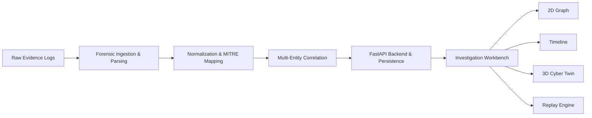

# Cyber-Twin

Interactive digital forensic incident reconstruction and investigation platform that correlates fragmented security evidence into a synchronized investigation workbench.

## Problem

Modern cybersecurity investigations require piecing together evidence scattered across isolated logs—including authentication records, endpoint process activity, internal server requests, file share audits, and perimeter network firewalls.

Because each source uses different formats, timestamps, and identifiers, investigators must manually correlate events to determine what happened, when it occurred, and which assets were impacted. This manual process causes investigation delays, missed attack paths, and high cognitive overhead during critical incident response.

## Solution

Cyber-Twin automates the transition from raw security logs to a coherent, reconstructed incident story. The platform ingests multi-source evidence, normalizes timestamps into UTC, discovers entities and relationships, and maps observed actions to the MITRE ATT&CK framework.

Investigators interact with the reconstructed incident through a synchronized workbench featuring a 2D topological relationship graph, a chronological timeline, an attack-path isolation toggle, a lightweight 3D Cyber Twin infrastructure view, and a time-series replay engine. The result is faster, more intuitive, and verifiable digital forensic investigation.

## Key Features

- **Multi-Source Ingestion:** Ingests authentication, endpoint, web server, file access, and firewall logs.
- **Automated Normalization:** Standardizes multi-format timestamps to UTC ISO-8601 and maps records to a canonical 11-field event model.
- **Deterministic Correlation:** Links discrete events by user accounts, device hostnames, IP addresses, servers, and files.
- **Chronological Timeline:** Sequences attack progression with MITRE ATT&CK tactical classifications.
- **Evidence Traceability:** Maintains cryptographic SHA-256 hashes and explicit provenance from findings back to raw evidence artifacts.
- **2D Relationship Graph:** Interactive network topology powered by Cytoscape.js using force-directed physics layout.
- **Attack-Path Isolation:** Dedicated toggle that highlights the adversarial kill chain while dimming background network activity.
- **3D Cyber Twin Layer:** Procedural Three.js visualization organizing infrastructure into External, Corporate LAN, and Datacenter security zones with animated threat beams.
- **Incident Replay Engine:** Chronological playback controls (Play, Pause, Step, Scrubber) with variable speeds (0.5x to 5x).
- **Forensic Inspector:** Contextual drawer detailing entity first/last seen times, associated IPs, and supporting evidence.

## How It Works



1. **Ingestion:** Reads heterogeneous log files and extracts structured fields without data loss.
2. **Parsing & Normalization:** Converts varying timestamps to UTC and standardizes event schemas.
3. **Evidence Mapping:** Identifies threat behaviors and maps them to MITRE ATT&CK techniques.
4. **Correlation:** Discovers entities and directed relationships across disparate log sources.
5. **Incident Reconstruction:** Synthesizes the full incident graph, timeline, and forensic findings.
6. **API Delivery:** FastAPI backend persists cases and serves graph/timeline payloads over REST.
7. **Visual Investigation:** Analyst investigates, isolates attack paths, and replays the attack.

## Investigation Workflow

A typical investigation flow in Cyber-Twin:

1. **Select Case:** Load an active investigation (e.g., `CASE-001`).
2. **Review Timeline:** Scan the reconstructed chronological attack sequence with tactical MITRE badges.
3. **Inspect Entities:** Identify involved user accounts, source workstations, destination IPs, and targeted servers.
4. **Explore the Graph:** Click nodes and edges in the 2D relationship graph to trace lateral movement.
5. **Isolate Attack Path:** Toggle **Attack Path Only** to filter out benign telemetry and illuminate the adversary's route.
6. **Replay in 3D:** Use replay transport controls to watch the intrusion unfold spatially across enterprise network zones.
7. **Verify Evidence:** Inspect supporting evidence artifacts and SHA-256 hashes for any highlighted event.

## Demo Scenario

The included demonstration (`CASE-001`) reconstructs an unauthorized lateral movement and data exfiltration intrusion:

```text
Compromised Account (employee01 on WORKSTATION-01 via auth.log)
    ↓
PowerShell Reconnaissance (powershell.exe spawn via endpoint.log)
    ↓
Lateral Movement (SMB connection to SRV-CORP-FILE via server.log)
    ↓
Sensitive File Staging (customer_data.csv access via file_access.log)
    ↓
Command & Control (Outbound TCP connection to 198.51.100.24 via firewall.log)
    ↓
Data Exfiltration (Bulk data transfer over port 443 via firewall.log)
```

- **Involved Assets:** `WORKSTATION-01` (`192.168.1.20`), `SRV-CORP-FILE`, `198.51.100.24`
- **Reconstructed Output:** 6 chronological events, 7 entities, 15 directed relationships, and 3 correlated critical findings.

## Technology Stack

| Layer | Technologies | Purpose |
|---|---|---|
| **Frontend** | React 19, JavaScript, TypeScript, Vite | Interactive analyst workbench and state synchronization |
| **2D Visualization** | Cytoscape.js | Dynamic force-directed entity-relationship network graph |
| **3D Visualization** | Three.js (WebGL) | Spatial digital twin infrastructure view with enterprise zones |
| **Backend API** | FastAPI, Uvicorn, Pydantic | Asynchronous REST API and schema validation |
| **Data & ORM** | SQLite, PostgreSQL, SQLAlchemy | Relational persistence for cases, evidence, events, and findings |
| **Forensic Engine** | Python 3.9+ | Multi-source log parsing, normalization, and correlation logic |
| **Testing** | pytest, unittest, Node.js | Automated unit, API, integration, and verification suites |

## Project Structure

```text
Cyber-Twin/
├── backend/            # FastAPI application, SQLAlchemy models, REST routers, and API tests
├── data/               # Raw multi-source evidence logs and processed reconstruction JSON artifacts
├── docs/               # Architecture blueprints, specifications, and workflows
├── forensic-engine/    # Log ingestion, parsers, normalizer, MITRE mapper, and correlator
├── frontend/           # React investigation workbench, Cytoscape graph, and Three.js 3D layer
├── tests/              # Forensic engine unit test suite (38 automated tests)
├── LICENSE             # MIT License file
└── README.md           # Project documentation
```

## Getting Started

### Prerequisites

- **Python:** 3.9 or higher
- **Node.js:** 18.0 or higher
- **PowerShell:** Windows PowerShell 5.1 or Core 7+

---

### 1. Run the Forensic Pipeline

Generate the processed reconstruction artifacts from raw evidence logs:

```powershell
python forensic-engine/pipeline.py
```

---

### 2. Start the Backend API

```powershell
# Navigate to backend
cd backend

# Create and activate virtual environment
python -m venv venv
.\venv\Scripts\Activate.ps1

# Install backend dependencies
pip install -r requirements.txt

# Start FastAPI server
python -m uvicorn app.main:app --host 127.0.0.1 --port 8000 --reload
```

- **API Base:** `http://127.0.0.1:8000`
- **Swagger Documentation:** `http://127.0.0.1:8000/docs`
- **Health Endpoint:** `http://127.0.0.1:8000/health`

---

### 3. Start the Frontend

Open a new PowerShell terminal:

```powershell
# Navigate to frontend
cd frontend

# Install dependencies (use npm.cmd on Windows if script execution policy applies)
npm.cmd install

# Start Vite development server
npm.cmd run dev
```

- **Frontend Workbench:** `http://localhost:5173`

---

## Verification

The repository includes test suites verifying data integrity, backend functionality, and visualization components:

| Subsystem | Test Suite | Verification Command | Status |
|---|---|---|:---:|
| **Forensic Pipeline** | 38 Python `unittest` tests | `python -m unittest discover tests -v` | Verified |
| **Backend REST API** | 36 `pytest` tests | `python -m pytest backend/tests -v` | Verified |
| **Core Integration** | Node.js verification script | `node frontend/src/visualization/verifyCoreIntegration.js` | Verified |
| **2D Graph & Timeline**| Node.js verification scripts | `node frontend/src/visualization/verifyRelationshipGraph.js` | Verified |
| **3D Cyber Twin** | Node.js verification script | `node frontend/src/visualization/verifyCyberTwin3D.js` | Verified |
| **Attack Path & Replay**| Node.js verification scripts | `node frontend/src/visualization/verifyAttackPath.js` | Verified |

---

## Why Cyber-Twin

- **Unifies Fragmented Evidence:** Eliminates manual correlation across isolated log files by synthesizing evidence into one relational model.
- **Narrates the Attack Story:** Translates raw, technical log lines into an understandable, chronological kill chain sequence.
- **Dual Visual Context:** Pairs topological lateral movement (2D) with physical infrastructure enterprise zones (3D).
- **Interactive Replay:** Enables security teams to step through an incident as it happened, improving debriefs and remediation.
- **Strict Evidence Traceability:** Anchors every graph node, timeline item, and finding to verifiable SHA-256 evidence records.

---

## Prototype Scope

Cyber-Twin is a functional prototype built for digital forensic demonstration, incident reconstruction, and evaluation. It focuses on deterministic log correlation, MITRE ATT&CK mapping, and synchronized visual triage across enterprise network environments.

## Future Scope

- **Additional Ingestion Connectors:** Native parsers for cloud audit trails (AWS CloudTrail, Azure Monitor, Kubernetes).
- **Scalable Graph Backend:** Direct integration with dedicated graph databases (e.g., Neo4j) for querying enterprise-scale topologies.
- **Automated Reporting:** One-click generation of court-ready forensic incident PDF summaries.
- **Authentication & RBAC:** Multi-tenant access controls and analyst activity audit logging.
- **Containerized Orchestration:** Docker Compose configuration for single-command full-stack deployment.

---

## License

This project is licensed under the MIT License. See the [LICENSE](LICENSE) file for details.
