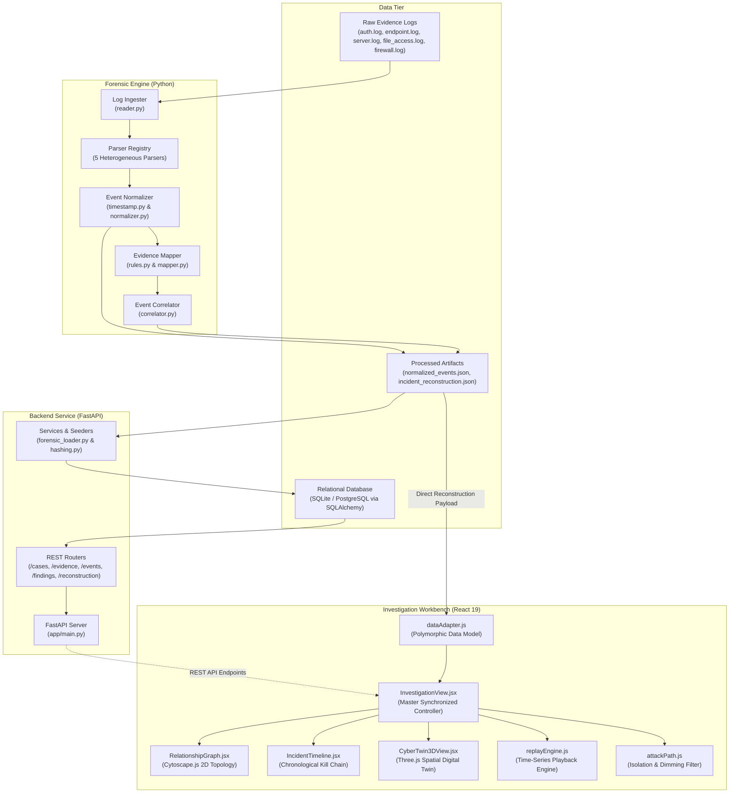
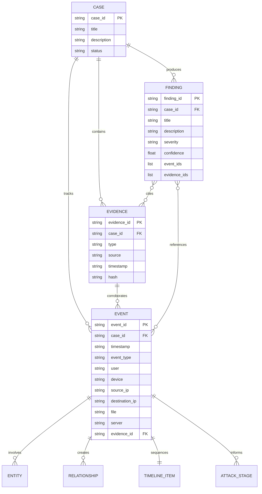

# Cyber-Twin

> Interactive Cybersecurity Investigation and Digital Forensic Incident Reconstruction Platform

Cyber-Twin is an interactive digital forensics and incident reconstruction platform designed to ingest multi-source security logs, normalize heterogeneous event telemetry, map adversarial activities to the MITRE ATT&CK framework, and synthesize fragmented evidence into an integrated, synchronized 2D/3D investigation workbench.

---

## Overview

Modern enterprise environments generate massive volumes of disparate security telemetry across authentication daemons, endpoint monitoring agents, web servers, file shares, and network firewalls. During incident response, forensic investigators face severe operational friction:

* **Fragmented Evidence:** Logs reside in isolated silos with conflicting timestamp formats, field naming conventions, and logging syntaxes.
* **Cognitive Overload:** Piecing together multi-stage cyberattacks from millions of discrete, raw log lines requires tedious manual cross-referencing.
* **Lack of Spatial & Temporal Context:** Traditional Security Information and Event Management (SIEM) tools present flat tabular rows that obscure the spatial topology of lateral movement and the chronological progression of an intrusion.
* **Weak Chain of Custody:** Establishing strict traceability from high-level investigative findings back to the raw evidentiary artifact is often manual and error-prone.

Cyber-Twin solves this challenge by implementing a deterministic digital forensic pipeline paired with a multi-layered visual workbench. The platform automatically normalizes raw evidence, correlates cross-source events into unified entities and relationships, traces kill chain progression, and renders the investigation across a synchronized 2D topological graph, chronological timeline, 3D digital twin infrastructure layer, and incident playback engine.

---

## Problem Statement

> **"Fragmented Cybersecurity Data and Lack of Integrated Incident Reconstruction for Effective Digital Forensic Investigation System"**

Digital forensic investigations frequently stall not from an absence of data, but from an absence of synthesis. When an enterprise experiences a multi-stage intrusion, indicators of compromise (IoCs) are scattered across authentication logs, endpoint process execution trees, perimeter firewall drop/accept records, and server file access audits. Without automated ingestion, UTC normalization, deterministic entity-relationship correlation, and visual reconstruction, security analysts struggle to rapidly identify patient zero, trace lateral movement, evaluate data exposure, and produce verifiable forensic conclusions.

---

## Solution

Cyber-Twin resolves evidence fragmentation through an end-to-end ingestion, reconstruction, and visualization architecture:

```text
Raw Evidence Logs (Auth, Endpoint, Web Server, File Access, Firewall)
      ↓
Forensic Ingestion (Line-by-line reading, whitespace sanitization, artifact isolation)
      ↓
Multi-Format Parsing (Regex log extraction into structured parsed records)
      ↓
Timestamp & Schema Normalization (UTC ISO-8601 formatting, canonical 11-field Event v1 model)
      ↓
Evidence Mapping (Deterministic rule-based mapping to MITRE ATT&CK tactics & techniques)
      ↓
Incident Correlation (Cross-source entity grouping, directed relationship linking, findings synthesis)
      ↓
Reconstruction Synthesis (Canonical incident reconstruction schema: graph, timeline, attack chain)
      ↓
FastAPI Backend (REST API serving cases, evidence, events, findings, and graph topologies)
      ↓
Interactive Investigation Workbench (Synchronized 2D Cytoscape graph, Timeline, 3D Cyber Twin, Replay)
```

---

## Key Features

### Digital Forensics & Ingestion
* **Multi-Source Log Ingestion:** Ingests raw telemetry from authentication logs (`auth.log`), endpoint process trackers (`endpoint.log`), HTTP access logs (`server.log`), file server audits (`file_access.log`), and packet filtering firewalls (`firewall.log`).
* **Format-Specific Parsers:** Purpose-built parsers isolate timestamps, usernames, device hostnames, IP addresses, process command lines, file paths, and network ports without data loss.
* **Canonical Event Normalization:** Converts non-standard log timestamps (syslog format, standard slash format, UNIX timestamps) into strict UTC ISO-8601 strings and maps events to an immutable 11-field `Event v1` data contract.
* **Cryptographic Evidence Traceability:** Implements SHA-256 hashing across evidence artifacts and preserves explicit foreign key links between raw evidence files, normalized events, and forensic findings.

### Correlation & Reconstruction
* **Rule-Based MITRE ATT&CK Mapping:** Deterministically maps normalized event types to MITRE ATT&CK tactics and techniques (e.g., Valid Accounts, PowerShell Execution, Lateral SMB Movement, Local Data Staging, Command & Control, Protocol Exfiltration).
* **Multi-Entity Graph Derivation:** Automatically discovers entities (Users, Devices, IP addresses, Servers, Files) and generates typed, directed relationships (`AUTHENTICATED_TO`, `EXECUTED`, `CONNECTED_TO`, `ACCESSED`, `EXFILTRATED_TO`).
* **Chronological Attack Progression:** Assembles a structured attack sequence linking each event to its kill chain phase, technique identifier, and evidence record.
* **Automated Findings Synthesis:** Correlates multi-event patterns to synthesize high-confidence forensic findings with severity scores.

### Investigation Workbench & Visualization
* **Synchronized Investigation Workbench:** Unified analyst dashboard where selection in any visualization immediately highlights corresponding elements across all other views.
* **2D Relationship Graph:** Interactive topological network powered by Cytoscape.js using the force-directed COSE layout, displaying entities as nodes and evidence-backed interactions as directed edges.
* **Chronological Incident Timeline:** Visual timeline presenting events in sequence with MITRE ATT&CK tactical badges, timestamps, and severity cues.
* **Attack Path Highlighting & Isolation:** Dedicated toggle that isolates adversarial progression (Patient Zero $\rightarrow$ Lateral Pivots $\rightarrow$ Target Server $\rightarrow$ Exfiltration IP) while dimming benign network background activity.
* **Lightweight 3D Cyber Twin Layer:** Procedural Three.js digital twin organizing enterprise infrastructure into three distinct security zones (External/Internet, Corporate LAN, Restricted Datacenter) with animated threat beams.
* **Incident Replay Playback Engine:** Dynamic time-series playback engine with Play, Pause, Step Next, Step Previous, Scrubbing, and variable playback speeds (0.5x, 1x, 2x, 5x).
* **Forensic Evidence Inspector:** Contextual drawer detailing raw evidence provenance, cryptographic hashes, entity first/last seen timestamps, and linked event telemetry.

---

## System Architecture

Cyber-Twin separates concerns between forensic log ingestion, backend API orchestration, and client-side visualization:



---

## Forensic Investigation Pipeline

The forensic engine (`forensic-engine/`) operates deterministically across five stages:

1. **Ingestion (`forensic-engine/ingestion/reader.py`):**
   * Reads raw log files line-by-line using UTF-8 encoding.
   * Strips extraneous whitespace, isolates line numbers, and classifies source types (`auth`, `endpoint`, `server`, `file_access`, `firewall`).
2. **Parsing (`forensic-engine/parsing/`):**
   * Employs specialized regular expression parsers inheriting from `BaseParser`.
   * Extracts structured fields into `ParsedLogRecord` instances containing timestamps, hostnames, usernames, process commands, IP addresses, ports, and accessed resources.
3. **Normalization (`forensic-engine/normalization/`):**
   * `timestamp.py` resolves varying timestamp conventions (e.g., `Oct 4 10:15:00`, `2026/10/04 10:18:30`, ISO-8601 strings) into standardized UTC ISO-8601 strings (`YYYY-MM-DDTHH:MM:SS`).
   * `normalizer.py` constructs deterministic event IDs (`EVT-001`, `EVT-002`, ...) and encapsulates data into the canonical 11-field `NormalizedEvent` record.
4. **Evidence Mapping (`forensic-engine/evidence-mapping/`):**
   * Evaluates normalized events against heuristic detection rules (`rules.py`).
   * Annotates events with MITRE ATT&CK tactic names, technique IDs, technique names, and affected entity references to produce `MappedEvent` objects.
5. **Correlation & Incident Reconstruction (`forensic-engine/correlation/`):**
   * `correlator.py` links discrete events sharing common entities (e.g., matching source workstation, user account, internal IP, or target file).
   * Generates a fully populated `ReconstructedIncident` containing topological nodes, directed canonical relationships, a sequential attack timeline, kill chain attack progression stages, and correlated forensic findings.

---

## Investigation Model

Cyber-Twin organizes digital forensic investigations according to a strict hierarchical and relational data model:



### Canonical Event Contract (Event v1)

All components (Forensic Engine, Database Models, REST API, and Frontend Data Adapters) adhere strictly to the 11-field Event v1 contract:

| Field | Type | Description | Example |
| :--- | :--- | :--- | :--- |
| `event_id` | `string` | Unique event identifier | `"EVT-001"` |
| `case_id` | `string` | Investigation case identifier | `"CASE-001"` |
| `timestamp` | `string` | Standardized UTC ISO-8601 timestamp | `"2026-10-04T10:15:00"` |
| `event_type` | `string` | Normalized action category | `"suspicious_login"` |
| `user` | `string \| null` | User account involved in event | `"employee01"` |
| `device` | `string \| null` | Workstation or endpoint hostname | `"WORKSTATION-01"` |
| `source_ip` | `string \| null` | Source IPv4 address | `"192.168.1.20"` |
| `destination_ip`| `string \| null` | Destination IPv4 address | `"198.51.100.24"` |
| `file` | `string \| null` | File path or executable name | `"\\SRV-CORP-FILE\\confidential\\customer_data.csv"` |
| `server` | `string \| null` | Enterprise server hostname | `"SRV-CORP-FILE"` |
| `evidence_id` | `string` | Supporting evidence artifact identifier | `"EVD-001"` |

---

## Evidence Traceability

Forensic integrity requires that high-level conclusions remain verifiable against raw evidence artifacts:

1. **Cryptographic Integrity:** Every raw evidence file registered in the backend is hashed using SHA-256 (`calculate_sha256` in `backend/app/services/hashing.py`). The cryptographic digest is stored in the database alongside artifact metadata.
2. **Provenance Chains:** Each normalized event retains an `evidence_id` foreign key referencing its originating evidence file.
3. **Traceability Mapping:** The frontend data adapter constructs an inverted `evidence_map` connecting each `evidence_id` to its associated events, entities, and timestamps:
   ```json
   {
     "EVD-004": {
       "evidence_id": "EVD-004",
       "event_ids": ["EVT-004"],
       "entity_ids": ["user:employee01", "device:WORKSTATION-01", "file:\\SRV-CORP-FILE\\confidential\\customer_data.csv", "server:SRV-CORP-FILE"],
       "timestamps": ["2026-10-04T10:22:45"]
     }
   }
   ```
4. **Verifiable Findings:** Correlated findings stored in the database explicitly record the array of `event_ids` and `evidence_ids` supporting the finding.

---

## Attack Reconstruction & MITRE ATT&CK Integration

Cyber-Twin reconstructs an intrusion chronologically across the cyber kill chain:

| Sequence | Event ID | UTC Timestamp | Event Type | Stage Name | MITRE ATT&CK Tactic | MITRE Technique | Description |
| :---: | :---: | :---: | :---: | :---: | :---: | :---: | :---: |
| 1 | `EVT-001` | `10:15:00` | `suspicious_login` | Initial Access | Initial Access | **T1078** (Valid Accounts) | Compromised credential logon from internal workstation |
| 2 | `EVT-002` | `10:18:30` | `suspicious_process_spawn`| Execution | Execution | **T1059.001** (PowerShell) | Execution of unquoted PowerShell script on host |
| 3 | `EVT-003` | `10:21:05` | `internal_server_connection` | Lateral Movement | Lateral Movement | **T1021.002** (SMB Shares) | Lateral pivot from workstation to corporate file server |
| 4 | `EVT-004` | `10:22:45` | `sensitive_file_access` | Collection | Collection | **T1005** (Data from Local System) | Access and staging of confidential customer records |
| 5 | `EVT-005` | `10:24:15` | `suspicious_network_connection` | Command & Control | Command and Control | **T1071** (App Layer Protocol) | Outbound connection established to external adversary infrastructure |
| 6 | `EVT-006` | `10:25:00` | `outbound_data_transfer` | Exfiltration | Exfiltration | **T1048** (Alternative Protocol) | Bulk transfer of staged data to external adversary IP |

---

## Visualization Workbench

The frontend provides an interactive, unified workbench (`InvestigationView.jsx`) with bidirectional event and entity synchronization:

### 1. Investigation Dashboard
* **Telemetry Bar:** Displays real-time case metrics including total events, discovered entities, directed relationships, and registered evidence records.
* **Active Focus Banner:** Highlights currently selected entities or events with a one-click action to clear focus and restore full graph visibility.
* **Responsive Split-Pane Layout:** Organizes the 2D topology graph, chronological timeline, 3D Cyber Twin layer, and evidence inspector into an integrated interface.

### 2. Incident Timeline (`IncidentTimeline.jsx`)
* Renders attack stages in strict chronological order with color-coded MITRE ATT&CK tactical badges (Initial Access, Execution, Lateral Movement, Collection, C2, Exfiltration).
* Clicking any timeline card illuminates associated nodes and edges in both the 2D relationship graph and 3D digital twin.

### 3. 2D Relationship Graph (`RelationshipGraph.jsx`)
* Interactive network topology built with **Cytoscape.js** using the force-directed **COSE layout**.
* Color-coded entity nodes: Users (Emerald), Devices (Cyan), IP Addresses (Orange), Servers (Purple), and Files (Amber).
* Directed edges with canonical relationship badges (`AUTHENTICATED_TO`, `RESOLVED_IP`, `USES`, `EXECUTED`, `CONNECTED_TO`, `ACCESSED`, `EXFILTRATED_TO`).
* Clicking nodes or edges filters linked timeline events and updates the forensic inspector.

### 4. Attack Path Isolation (`attackPath.js`)
* Dedicated **"Attack Path Only"** toggle that isolates adversary movement across the enterprise.
* Strongly dims benign network background nodes (to 10% opacity) and edges while highlighting the high-risk attack path in glowing red.

### 5. 3D Cyber Twin Infrastructure Layer (`CyberTwin3DView.jsx` & `cyberTwin3D.js`)
* Procedural WebGL scene rendered with **Three.js** organizing infrastructure into three enterprise network zones:
  * **External / Internet Zone:** Red perimeter boundary representing external adversary infrastructure (`198.51.100.0/24`).
  * **Corporate LAN Zone:** Cyan perimeter boundary representing internal workstations and end-users (`192.168.1.0/24`).
  * **Restricted Datacenter Zone:** Purple perimeter boundary housing high-value corporate file and database servers.
* Procedural 3D geometries for rack servers, desktop workstations, user identities, and data prisms.
* Animated quadratic bezier threat beams simulating live packet transmission and data exfiltration.
* Smooth camera fly-to animations and raycaster hover tooltips for interactive spatial exploration.

### 6. Incident Replay Playback Engine (`replayEngine.js`)
* Interactive time-series playback engine simulating the incident chronologically.
* Comprehensive transport controls: **Play**, **Pause**, **Step Forward**, **Step Backward**, and **Scrubber Bar**.
* Multi-speed playback options: **0.5x**, **1x**, **2x**, and **5x**.
* Automatically advances graph highlights, timeline cards, and 3D threat beams in sync with playback.

### 7. Forensic Evidence & Event Inspector
* Deep inspection drawer presenting metadata for selected entities and events.
* Shows entity first-seen and last-seen timestamps, associated IP addresses, raw evidence provenance, and SHA-256 cryptographic hashes.

---

## Technology Stack

| Layer | Component / Tool | Version / Specification | Purpose |
| :--- | :--- | :--- | :--- |
| **Language (Backend)** | Python | $\ge$ 3.9 | Core forensic pipeline, API, and correlation engine |
| **Language (Frontend)**| JavaScript / TypeScript | ES2022 / TS 5.x | Interactive UI, 3D graphics, data adapters, type contracts |
| **Backend Framework** | FastAPI | $\ge$ 0.110.0 | High-performance asynchronous REST API server |
| **ASGI Server** | Uvicorn | $\ge$ 0.28.0 | Production-ready ASGI web server |
| **Database & ORM** | SQLAlchemy | $\ge$ 2.0.28 | Object-Relational Mapping for SQLite / PostgreSQL |
| **Database Engines** | SQLite / PostgreSQL | Embedded / 15+ | Relational storage for cases, evidence, events, findings |
| **Data Validation** | Pydantic | $\ge$ 2.6.0 | Strict request/response schema validation |
| **Frontend Framework** | React | $\ge$ 19.3.0 | Component-based reactive user interface |
| **2D Graph Engine** | Cytoscape.js | $\ge$ 3.34.3 | Interactive entity-relationship topology graph |
| **3D Engine** | Three.js | $\ge$ 0.186.1 | WebGL procedural 3D cyber twin infrastructure layer |
| **Build & Dev Tool** | Vite | $\ge$ 8.3.2 | Fast ES module frontend bundler and development server |
| **Backend Testing** | Pytest / Unittest | $\ge$ 8.0.0 | Automated unit, API, and integration test suites |
| **Frontend Testing** | Node.js Test Runner | $\ge$ 18.0.0 | Verification test scripts for data, replay, and 3D logic |

---

## Repository Structure

```text
Cyber-Twin/
├── backend/
│   ├── .env.example                       # Environment configuration template
│   ├── README.md                          # Backend architecture documentation
│   ├── requirements.txt                   # Python package dependencies
│   ├── app/
│   │   ├── main.py                        # FastAPI application entry & CORS middleware
│   │   ├── database/
│   │   │   ├── connection.py              # SQLAlchemy engine & session dependency
│   │   │   └── seed_data.py               # Demonstration seeder (CASE-001)
│   │   ├── models/                        # SQLAlchemy ORM models
│   │   │   ├── case.py                    # CaseModel definition
│   │   │   ├── event.py                   # EventModel (11-field Event v1 contract)
│   │   │   ├── evidence.py                # EvidenceModel (SHA-256 hash tracking)
│   │   │   └── finding.py                 # FindingModel (Correlated forensic findings)
│   │   ├── routes/                        # REST API endpoint routers
│   │   │   ├── cases.py                   # Case CRUD endpoints
│   │   │   ├── events.py                  # Event retrieval & ingestion endpoints
│   │   │   ├── evidence.py                # Evidence artifact registration endpoints
│   │   │   ├── findings.py                # Forensic findings endpoints
│   │   │   └── reconstruction.py          # Reconstruction, graph & timeline endpoints
│   │   ├── schemas/                       # Pydantic validation schemas
│   │   │   ├── case.py                    # Case request/response models
│   │   │   ├── event.py                   # EventBase, EventCreate, EventResponse
│   │   │   ├── evidence.py                # EvidenceCreate, EvidenceResponse
│   │   │   ├── finding.py                 # FindingCreate, FindingResponse
│   │   │   └── reconstruction.py          # GraphData, TimelineItem, IncidentReconstruction
│   │   └── services/
│   │       ├── forensic_loader.py         # JSON loader & database ingestion service
│   │       └── hashing.py                 # Cryptographic SHA-256 hashing utility
│   └── tests/                             # Pytest backend API test suite (36 tests)
│       ├── conftest.py                    # Test client & in-memory SQLite fixtures
│       ├── test_cases.py                  # Case API endpoint tests
│       ├── test_events.py                 # Event API & contract tests
│       ├── test_evidence.py               # Evidence API & hashing tests
│       ├── test_findings.py               # Findings API tests
│       ├── test_forensic_integration.py   # Ingestion & loader integration tests
│       ├── test_hashing.py                # SHA-256 unit tests
│       ├── test_health.py                 # Service health check test
│       └── test_reconstruction.py         # Incident reconstruction API tests
├── data/
│   ├── processed/                         # Processed canonical artifacts
│   │   ├── incident_reconstruction.json   # Full correlated canonical reconstruction
│   │   └── normalized_events.json         # Normalized 11-field event dataset
│   └── raw/                               # Raw evidence log artifacts
│       ├── auth.log                       # SSH/PAM authentication logs
│       ├── endpoint.log                   # Process execution telemetry
│       ├── file_access.log                # SMB file audit logs
│       ├── firewall.log                   # Network packet filter logs
│       └── server.log                     # Web access logs
├── docs/                                  # Project documentation
│   ├── api/README.md                      # API specifications
│   ├── architecture/
│   │   ├── CYBER_TWIN_REPLAY_SPEC.md      # Replay engine & synchronization specification
│   │   └── README.md                      # High-level architecture blueprint
│   ├── screenshots/README.md              # Screenshot placeholder
│   └── workflows/README.md                # Forensic workflows
├── forensic-engine/                       # Core digital forensics processing engine
│   ├── pipeline.py                        # Master pipeline coordinator & CLI
│   ├── correlation/                       # Multi-entity incident correlator
│   │   ├── correlator.py                  # Graph, timeline & findings correlator
│   │   └── models.py                      # ReconstructedIncident dataclasses
│   ├── evidence-mapping/                  # MITRE ATT&CK evidence mapping
│   │   ├── mapper.py                      # Event enrichment mapper
│   │   ├── models.py                      # MappedEvent dataclass
│   │   └── rules.py                       # Heuristic detection rules
│   ├── ingestion/                         # Raw log ingestion reader
│   │   ├── models.py                      # RawLogRecord dataclass
│   │   └── reader.py                      # LogIngester implementation
│   ├── normalization/                     # Normalization subsystem
│   │   ├── models.py                      # NormalizedEvent (11 fields)
│   │   ├── normalizer.py                  # Deterministic normalizer
│   │   └── timestamp.py                   # Multi-format UTC timestamp parser
│   └── parsing/                           # Heterogeneous log parsers
│       ├── auth_parser.py                 # Authentication log parser
│       ├── base.py                        # BaseParser abstract interface
│       ├── endpoint_parser.py             # Process spawn parser
│       ├── file_access_parser.py          # File audit parser
│       ├── firewall_parser.py             # Network packet filter parser
│       ├── registry.py                    # Parser registry & dispatcher
│       └── server_parser.py               # Web server log parser
├── frontend/
│   ├── package.json                       # Node dependencies & scripts
│   ├── package-lock.json                  # Resolved dependency tree
│   └── src/
│       └── visualization/                 # Core visualization modules
│           ├── CyberTwin3DView.jsx        # Three.js 3D infrastructure React component
│           ├── IncidentTimeline.jsx       # Chronological timeline React component
│           ├── InvestigationView.jsx      # Master synchronized workbench component
│           ├── RelationshipGraph.jsx      # Cytoscape 2D relationship graph component
│           ├── attackPath.js              # Attack path isolation & dimming engine
│           ├── cyberTwin3D.js             # Procedural 3D scene model builder
│           ├── dataAdapter.js             # Polymorphic CyberTwinDataModel adapter
│           ├── graphElements.js           # Cytoscape node/edge elements & styles
│           ├── index.js                   # Visual module entry point (ESM)
│           ├── mockEvents.json            # 7-event demonstration dataset
│           ├── replayEngine.js            # Time-series incident replay engine
│           ├── types.ts                   # TypeScript data & component contracts
│           ├── verifyAttackPath.js        # Node verification test: Attack path
│           ├── verifyBrowserE2E.js        # Chrome DevTools browser E2E test
│           ├── verifyCoreIntegration.js   # Full pipeline-to-visualization test
│           ├── verifyCyberTwin3D.js       # Node verification test: 3D scene
│           ├── verifyDataLayer.js         # Node verification test: Data adapter
│           ├── verifyFrontendIntegration.js # Node verification test: Component mount
│           ├── verifyGraphTimelineSync.js # Node verification test: Graph/timeline sync
│           ├── verifyIncidentReplay.js    # Node verification test: Replay engine
│           ├── verifyIncidentTimeline.js  # Node verification test: Timeline
│           ├── verifyInvestigationView.js # Node verification test: Workbench state
│           └── verifyRelationshipGraph.js # Node verification test: Cytoscape graph
├── tests/                                 # Forensic Engine unit test suite (38 tests)
│   ├── test_correlation.py                # Graph & timeline correlation tests
│   ├── test_evidence_mapping.py           # MITRE ATT&CK mapping rule tests
│   ├── test_ingestion.py                  # Log ingestion reader tests
│   ├── test_normalization.py              # Timestamp & field normalization tests
│   ├── test_parsing.py                    # Log parser tests
│   └── test_pipeline.py                   # End-to-end pipeline execution tests
├── LICENSE                                # MIT License file
└── README.md                              # Project documentation
```

---

## REST API Reference

The FastAPI service exposes 16 endpoints for case management, evidence registration, event queries, and incident reconstruction:

| Method | Endpoint | Description | Request Body / Parameters | Response Model |
| :--- | :--- | :--- | :--- | :--- |
| `GET` | `/health` | Service health check | None | `{"status": "ok"}` |
| `GET` | `/cases` | List all forensic cases | None | `List[CaseResponse]` |
| `POST` | `/cases` | Create a new case | `CaseCreate` (`title`, `description`, `status`) | `CaseResponse` (201) |
| `GET` | `/cases/{case_id}` | Retrieve case details | Path: `case_id` | `CaseResponse` |
| `GET` | `/cases/{case_id}/evidence` | List registered evidence | Path: `case_id` | `List[EvidenceResponse]` |
| `POST` | `/cases/{case_id}/evidence` | Register evidence artifact | Path: `case_id`, Body: `EvidenceCreate` | `EvidenceResponse` (201) |
| `GET` | `/cases/{case_id}/events` | List normalized events | Path: `case_id` | `List[EventResponse]` |
| `POST` | `/cases/{case_id}/events` | Create single event | Path: `case_id`, Body: `EventCreate` | `EventResponse` (201) |
| `POST` | `/cases/{case_id}/events/bulk` | Bulk import events | Path: `case_id`, Body: `List[EventCreate]` | `List[EventResponse]` (201) |
| `POST` | `/cases/{case_id}/events/import-processed` | Import events JSON file | Path: `case_id`, Query: `file_path` | `List[EventResponse]` (201) |
| `GET` | `/cases/{case_id}/findings` | List forensic findings | Path: `case_id` | `List[FindingResponse]` |
| `POST` | `/cases/{case_id}/findings` | Record forensic finding | Path: `case_id`, Body: `FindingCreate` | `FindingResponse` (201) |
| `GET` | `/cases/{case_id}/reconstruction` | Full reconstruction data | Path: `case_id` | `IncidentReconstructionResponse` |
| `GET` | `/cases/{case_id}/reconstruction/graph` | Cytoscape graph data | Path: `case_id` | `GraphData` (`nodes`, `edges`) |
| `GET` | `/cases/{case_id}/reconstruction/timeline` | Attack timeline stages | Path: `case_id` | `List[TimelineItemResponse]` |
| `POST` | `/cases/{case_id}/reconstruction/import-processed` | Import reconstruction JSON | Path: `case_id`, Query: `file_path` | `IncidentReconstructionResponse` (201) |

---

## Demo Investigation (`CASE-001`)

The demonstration case (`CASE-001: Unauthorized Lateral Movement and Data Exfiltration`) showcases an attack scenario reconstructed across 6 events, 7 entities, 15 directed relationships, and 3 correlated findings:

### Attack Sequence Summary

1. **Initial Access (`EVT-001` at 10:15:00 UTC):**
   * Compromised user account `employee01` logs into workstation `WORKSTATION-01` (`192.168.1.20`) via SSH. Corroborated by `auth.log` (`EVD-001`).
2. **Execution (`EVT-002` at 10:18:30 UTC):**
   * Adversary spawns an unquoted `powershell.exe` execution on `WORKSTATION-01` to initiate reconnaissance. Corroborated by `endpoint.log` (`EVD-002`).
3. **Lateral Movement (`EVT-003` at 10:21:05 UTC):**
   * Workstation pivots to internal file server `SRV-CORP-FILE` using SMB administrative shares over port 445. Corroborated by `server.log` (`EVD-003`).
4. **Collection (`EVT-004` at 10:22:45 UTC):**
   * Unauthorized read access and local staging of `\\SRV-CORP-FILE\confidential\customer_data.csv`. Corroborated by `file_access.log` (`EVD-004`).
5. **Command & Control (`EVT-005` at 10:24:15 UTC):**
   * Outbound TCP connection established from `192.168.1.20` to external adversary infrastructure `198.51.100.24`. Corroborated by `firewall.log` (`EVD-005`).
6. **Exfiltration (`EVT-006` at 10:25:00 UTC):**
   * Bulk exfiltration of the staged sensitive dataset over an alternative network protocol. Corroborated by `firewall.log` (`EVD-005`).

### Correlated Forensic Findings

* **`FND-001` (CRITICAL, Confidence 0.95):** Credential Compromise & Unauthorized Initial Access on `WORKSTATION-01`.
* **`FND-002` (HIGH, Confidence 0.90):** Internal Network Pivoting to High-Value File Server `SRV-CORP-FILE`.
* **`FND-003` (CRITICAL, Confidence 0.98):** Unauthorized Access and Exfiltration of Confidential Customer Data.

---

## Installation & Setup

### Prerequisites
* **Python:** Version 3.9 or higher (Python 3.10+ recommended)
* **Node.js:** Version 18.0.0 or higher
* **Git:** Version 2.30 or higher
* **PowerShell:** Windows PowerShell 5.1 or PowerShell Core 7+ (on Windows)

### 1. Clone the Repository
```powershell
git clone https://github.com/rutuja-bot/Cyber-Twin.git
cd Cyber-Twin
```

### 2. Backend Setup
Create and activate a virtual environment, then install dependencies:

```powershell
# Create virtual environment
python -m venv venv

# Activate virtual environment on Windows
.\venv\Scripts\Activate.ps1

# Install backend dependencies
pip install -r backend/requirements.txt
```

### 3. Frontend Setup
Install frontend packages using npm:

```powershell
cd frontend
npm.cmd install
cd ..
```

*(Note: On Windows PowerShell, use `npm.cmd` if running into script execution policy restrictions.)*

---

## Running the Prototype

### Step 1: Execute the Forensic Pipeline
Run the forensic pipeline to ingest raw logs and produce processed artifacts:

```powershell
python forensic-engine/pipeline.py
```

Expected output:
```text
[+] Successfully processed 6 normalized events for case CASE-001
[+] Normalized events saved to: data/processed/normalized_events.json
[+] Reconstructed incident saved to: data/processed/incident_reconstruction.json
[+] Timeline entries: 6 | Graph Nodes: 7 | Edges: 15
[+] Attack Progression Stages: 6 | Findings: 3
```

### Step 2: Start the FastAPI Backend
Start the backend server with automatic reload:

```powershell
cd backend
python -m uvicorn app.main:app --host 127.0.0.1 --port 8000 --reload
```

The interactive API documentation is available at:
* Swagger UI: [http://127.0.0.1:8000/docs](http://127.0.0.1:8000/docs)
* ReDoc: [http://127.0.0.1:8000/redoc](http://127.0.0.1:8000/redoc)

### Step 3: Verify Backend Availability
In a separate terminal, test the service:

```powershell
# Verify service health
Invoke-RestMethod http://127.0.0.1:8000/health

# Verify seeded cases
Invoke-RestMethod http://127.0.0.1:8000/cases

# Verify full incident reconstruction
Invoke-RestMethod http://127.0.0.1:8000/cases/CASE-001/reconstruction
```

### Step 4: Run Visualization Verification Suites
Run the Node.js verification suites to validate all visual components:

```powershell
# Core integration verification (Backend reconstruction -> Visualization pipeline)
node frontend/src/visualization/verifyCoreIntegration.js

# Data layer and schema normalization verification
node frontend/src/visualization/verifyDataLayer.js

# 2D Relationship Graph verification
node frontend/src/visualization/verifyRelationshipGraph.js

# Chronological Timeline verification
node frontend/src/visualization/verifyIncidentTimeline.js

# Attack Path Isolation verification
node frontend/src/visualization/verifyAttackPath.js

# 3D Cyber Twin Scene Model verification
node frontend/src/visualization/verifyCyberTwin3D.js

# Incident Replay Engine verification
node frontend/src/visualization/verifyIncidentReplay.js
```

---

## Testing & Verification

Cyber-Twin includes 74 automated tests across the forensic pipeline and backend API, alongside 10 standalone frontend verification scripts:

### Running Forensic Engine Unit Tests (38 Tests)
```powershell
python -m unittest discover tests -v
```

Tests verify:
* `test_ingestion.py`: Multi-source log reading, line filtering, comment stripping (6 tests)
* `test_parsing.py`: Format parsing for auth, endpoint, server, file access, and firewall logs (7 tests)
* `test_normalization.py`: UTC ISO-8601 parsing, deterministic event IDs, 11-field contract (6 tests)
* `test_evidence_mapping.py`: MITRE ATT&CK rule execution and technique classification (7 tests)
* `test_correlation.py`: Graph node/edge derivation, chronological ordering, findings synthesis (6 tests)
* `test_pipeline.py`: Full end-to-end pipeline execution from raw logs to JSON artifacts (6 tests)

### Running Backend API Pytest Suite (36 Tests)
```powershell
python -m pytest backend/tests -v
```

Tests verify:
* `test_health.py`: Endpoint availability and health status (1 test)
* `test_cases.py`: Case creation, duplicate rejection, retrieval, 404 handling (5 tests)
* `test_evidence.py`: Evidence artifact registration, content hashing, duplicate checks (6 tests)
* `test_events.py`: Event CRUD, 11-field contract validation, bulk import (5 tests)
* `test_findings.py`: Forensic finding creation and evidence linking (4 tests)
* `test_hashing.py`: SHA-256 cryptographic calculation across strings, bytes, and edge cases (4 tests)
* `test_reconstruction.py`: Graph retrieval, timeline retrieval, processed JSON ingestion (6 tests)
* `test_forensic_integration.py`: Seeding consistency, processed file loader verification (4 tests)

---

## Prototype Verification Summary

| Component | Test Suite | Verification Method | Status |
| :--- | :--- | :--- | :---: |
| **Forensic Ingestion & Parsing** | `tests/test_ingestion.py`, `test_parsing.py` | 13 Python unit tests | ✅ PASS |
| **Timestamp & Schema Normalization** | `tests/test_normalization.py` | 6 Python unit tests | ✅ PASS |
| **Evidence Mapping & MITRE Rules** | `tests/test_evidence_mapping.py` | 7 Python unit tests | ✅ PASS |
| **Correlation & Graph Generation** | `tests/test_correlation.py` | 6 Python unit tests | ✅ PASS |
| **End-to-End Pipeline Execution** | `tests/test_pipeline.py` | 6 Python unit tests | ✅ PASS |
| **FastAPI REST Service** | `backend/tests/test_*.py` | 36 Pytest API tests | ✅ PASS |
| **Cryptographic Hashing (SHA-256)**| `backend/tests/test_hashing.py` | 4 Pytest unit tests | ✅ PASS |
| **Core End-to-End Integration** | `verifyCoreIntegration.js` | Node.js verification script | ✅ PASS |
| **2D Cytoscape Graph Rendering** | `verifyRelationshipGraph.js` | Node.js verification script | ✅ PASS |
| **Chronological Timeline UI** | `verifyIncidentTimeline.js` | Node.js verification script | ✅ PASS |
| **3D Cyber Twin Scene Model** | `verifyCyberTwin3D.js` | Node.js verification script | ✅ PASS |
| **Replay Playback Engine** | `verifyIncidentReplay.js` | Node.js verification script | ✅ PASS |
| **Attack Path Isolation Engine** | `verifyAttackPath.js` | Node.js verification script | ✅ PASS |

---

## Security & Forensic Design Principles

* **Immutable Evidentiary Provenance:** Normalized events do not alter underlying logs. Raw evidence records retain cryptographic SHA-256 hashes to guarantee chain of custody.
* **Deterministic Normalization:** The forensic engine executes deterministic parsing and UTC timestamp conversion, ensuring identical input logs produce byte-identical reconstruction artifacts.
* **Separation of Evidence and Analysis:** Raw normalized events contain purely factual observations (source IP, destination IP, user, device, action). Analytic conclusions (attack stage, severity, MITRE tactics) are maintained in separate mapping and finding layers.
* **Synchronized Visual Telemetry:** Investigation views are bi-directionally synchronized to reduce analyst disorientation during high-stress incident triage.
* **Defensive Resource Management:** The 3D Cyber Twin WebGL renderer implements comprehensive disposal procedures (`geometry.dispose()`, `material.dispose()`, animation frame cancellation) to prevent memory leaks during extended investigation sessions.

---

## Limitations

* **Prototype Scope:** The current implementation is an evaluated prototype developed for technical demonstration and competition evaluation (She Solves 3.0 Round 2).
* **Heuristic Correlation:** Event correlation is rule-based and tuned to known enterprise attack patterns; it does not currently use machine learning models or probabilistic inference.
* **Unauthenticated Endpoints:** The prototype API does not implement JWT or role-based access control (RBAC); endpoints are open for local evaluation.
* **Single Case Active In-Memory:** The backend caches the active reconstruction in memory for rapid visualization serving, which is intended for single-incident evaluation rather than multi-tenant concurrent operations.

---

## Future Enhancements

* **Additional Log Formats:** Ingestion parsers for cloud infrastructure audit trails (AWS CloudTrail, Azure Activity Logs, Google Cloud Audit Logs, Kubernetes audit events).
* **Scalable Graph Storage:** Integration with native graph databases (Neo4j / Amazon Neptune) to support Cypher graph queries across multi-million event datasets.
* **Production Authentication & RBAC:** Multi-tenant role-based access control with investigator audit logging and session management.
* **Automated Forensic Reporting:** Export module generating digitally signed, court-ready PDF forensic investigation reports with chain-of-custody certificates.
* **Containerized Deployment:** Dockerfile and Docker Compose orchestration profiles for single-command deployment across development, staging, and production environments.

---

## Project Status

* **Status:** Completed Prototype
* **Context:** Developed and evaluated for **She Solves 3.0 — Round 2**
* **Evaluation Focus:** Digital Forensics, Incident Reconstruction, Multi-Source Correlation, 2D/3D Interactive Visualization

---

## Team & Authors

* **Sakshi** — Visualization & Cyber Twin Lead
* **Rutuja Patil** — Backend Architecture & Forensic Integration Lead
* **Cyber-Twin Team** — Core Contributors & Researchers

---

## License

This project is licensed under the MIT License. See the [LICENSE](LICENSE) file for details.
