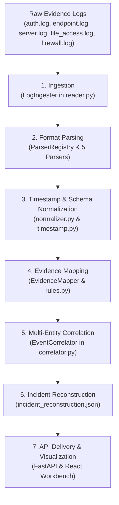

# Forensic Processing Pipeline

**Project:** Cyber-Twin — Digital Forensics & Incident Reconstruction Platform  
**Pipeline Execution:** Python 3.9+ Standard Library (Deterministic & Dependency-Free)  

---

## 1. Pipeline Overview

The Cyber-Twin Forensic Pipeline deterministically transforms raw, fragmented security evidence into a structured, correlated, and evidence-backed incident reconstruction. The pipeline guarantees evidentiary integrity, standardizes disparate event formats, maps threat behaviors to the MITRE ATT&CK taxonomy, and produces graph and timeline models consumed by the FastAPI backend and React workbench.

---

## 2. Pipeline Sequence Diagram



---

## 3. Pipeline Stages & Execution Flow

### Stage 1: Evidence Ingestion (`ingestion/reader.py`)
* **Input:** Raw log files located in `data/raw/`.
* **Process:** Reads log files line-by-line using UTF-8 encoding. Strips extraneous whitespace, isolates line numbers, removes blank lines and `#` comments, and classifies each record by source type (`auth`, `endpoint`, `server`, `file_access`, `firewall`).
* **Output:** Stream of `RawLogRecord` objects containing file path, line number, raw text, and source type.

### Stage 2: Format Parsing (`parsing/`)
* **Input:** `RawLogRecord` objects.
* **Process:** Dispatches records through the `ParserRegistry` to format-specific regular expression parsers:
  * `AuthParser`: Extracts logon status, usernames, PAM services, and source IP addresses.
  * `EndpointParser`: Extracts process creation commands (`powershell.exe`), hostnames, and process trees.
  * `ServerParser`: Extracts HTTP request methods, URI paths, client IPs, and status codes.
  * `FileAccessParser`: Extracts SMB file paths, read/write actions, and accessing user accounts.
  * `FirewallParser`: Extracts network packet drop/accept actions, source/destination IPs, and target ports.
* **Output:** Structured `ParsedLogRecord` objects with isolated telemetry attributes.

### Stage 3: Timestamp & Schema Normalization (`normalization/`)
* **Input:** `ParsedLogRecord` objects.
* **Process:**
  * `timestamp.py` resolves varying timestamp conventions (Syslog: `Oct 4 10:15:00`, Slash format: `2026/10/04 10:18:30`, ISO strings) into standardized UTC ISO-8601 strings (`YYYY-MM-DDTHH:MM:SS`).
  * `normalizer.py` assigns deterministic event identifiers (`EVT-001`, `EVT-002`, ...) and encapsulates data into the canonical 11-field **Event v1** schema.
* **Output:** `data/processed/normalized_events.json`.

#### Canonical Event v1 Representation
```text
event_id        : string (e.g., "EVT-001")
case_id         : string (e.g., "CASE-001")
timestamp       : string (UTC ISO-8601, e.g., "2026-10-04T10:15:00")
event_type      : string (e.g., "suspicious_login")
user            : string | null (e.g., "employee01")
device          : string | null (e.g., "WORKSTATION-01")
source_ip       : string | null (e.g., "192.168.1.20")
destination_ip  : string | null (e.g., "198.51.100.24")
file            : string | null (e.g., "customer_data.csv")
server          : string | null (e.g., "SRV-CORP-FILE")
evidence_id     : string (e.g., "EVD-001")
```

### Stage 4: Evidence Mapping & MITRE ATT&CK Classification (`evidence-mapping/`)
* **Input:** `NormalizedEvent` objects.
* **Process:** Evaluates normalized event fields against detection heuristics in `rules.py`. Annotates events with MITRE ATT&CK tactical classifications:
  * `suspicious_login` $\rightarrow$ **T1078** (Valid Accounts) | *Initial Access*
  * `suspicious_process_spawn` $\rightarrow$ **T1059.001** (PowerShell) | *Execution*
  * `internal_server_connection` $\rightarrow$ **T1021.002** (SMB Shares) | *Lateral Movement*
  * `sensitive_file_access` $\rightarrow$ **T1005** (Data from Local System) | *Collection*
  * `suspicious_network_connection` $\rightarrow$ **T1071** (App Layer Protocol) | *Command & Control*
  * `outbound_data_transfer` $\rightarrow$ **T1048** (Alternative Protocol) | *Exfiltration*
* **Output:** Enriched `MappedEvent` objects retaining explicit evidence foreign-key relationships.

### Stage 5: Multi-Entity Correlation & Graph Derivation (`correlation/`)
* **Input:** `MappedEvent` objects.
* **Process:** The `EventCorrelator` analyzes shared identifiers across discrete log records:
  1. **Entity Discovery:** Groups identifiers into distinct entities (Users, Workstations, Servers, IP Addresses, Files) and tracks `first_seen` and `last_seen` timestamps.
  2. **Directed Relationship Synthesis:** Derives typed, directed interactions (`AUTHENTICATED_TO`, `RESOLVED_IP`, `USES`, `EXECUTED`, `CONNECTED_TO`, `ACCESSED`, `EXFILTRATED_TO`).
  3. **Timeline Reconstruction:** Chronologically sequences events to form a coherent attack timeline.
  4. **Kill Chain Stages:** Maps sequential stages across the cyber kill chain.
  5. **Findings Generation:** Correlates multi-event patterns to synthesize high-confidence forensic findings with severity scores.
* **Output:** `ReconstructedIncident` model serialized to `data/processed/incident_reconstruction.json`.

---

## 4. Evidentiary Traceability Model

Cyber-Twin enforces strict evidentiary chain of custody through a structured relational hierarchy:

```text
Evidence Artifact (Raw file + SHA-256 Hash + EVD-ID)
      ↓
Normalized Event (11-field record + EVT-ID + Foreign Key to Evidence)
      ↓
Chronological Timeline Item (Sequential Step + MITRE Technique)
      ↓
Attack Progression Stage (Kill Chain Phase + Corroborating Events)
      ↓
Forensic Finding (Correlated Insight + Severity + Evidence Citations)
```

1. **Cryptographic Checksums:** Every raw evidence file registered in the backend is hashed using SHA-256 (`hashing.py`). The cryptographic digest is stored in the database alongside artifact metadata.
2. **Provenance Chains:** Each normalized event retains an `evidence_id` foreign key referencing its originating evidence file.
3. **Inverted Traceability Map:** The correlator builds an inverted lookup index connecting each evidence ID to its corroborating events, entities, and timestamps.
4. **Verifiable Conclusions:** Every forensic finding explicitly references the array of `event_ids` and `evidence_ids` that validate it.

---

## 5. Pipeline Execution & Summary Output

The pipeline is executed directly from PowerShell:

```powershell
python forensic-engine/pipeline.py
```

### Execution Summary (CASE-001)
* **Events Processed:** 6 normalized events
* **Entities Discovered:** 7 entities (1 user, 1 device, 2 IPs, 1 server, 2 files/executables)
* **Relationships Derived:** 15 directed topological edges
* **Attack Progression Stages:** 6 sequential kill chain phases
* **Forensic Findings:** 3 critical findings with confidence ratings
* **Output Artifacts:** `data/processed/normalized_events.json` and `data/processed/incident_reconstruction.json`

