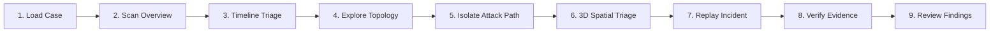

# Investigation Workflow

**Project:** Cyber-Twin — Digital Forensics & Incident Reconstruction Platform  
**Target User:** Digital Forensic Investigator & Incident Response Analyst  
**User Interface:** Investigation Workbench (`frontend/src/visualization/InvestigationView.jsx`)  

---

## 1. Workflow Overview

Cyber-Twin empowers security analysts to transition from examining flat, disjointed log entries to navigating a unified, synchronized investigation workbench. The frontend loads the reconstructed incident data from the FastAPI backend and presents an interactive environment where chronological, topological, spatial, and evidentiary perspectives remain continuously synchronized.

---

## 2. Step-by-Step Investigation Workflow

### Step 1: Open Cyber-Twin & Load Case
* **Action:** Launch the workbench in the browser and select the active investigation (e.g., `CASE-001`).
* **What Happens:** The frontend queries `GET /cases/CASE-001/reconstruction` from the FastAPI backend, populating the data adapter with the full incident topology, timeline, and findings.
* **Analyst Gain:** Immediate loading of an end-to-end reconstructed incident without manual data stitching.

### Step 2: View Incident Overview & Telemetry
* **Action:** Review the top telemetry banner.
* **What Happens:** The header displays real-time case metrics: Total Events (6), Discovered Entities (7), Directed Relationships (15), and Registered Evidence Records (5).
* **Analyst Gain:** Rapid situation awareness regarding the breadth and impact of the intrusion.

### Step 3: Examine Chronological Timeline
* **Action:** Scan the chronological cards in the **Incident Timeline** panel on the left.
* **What Happens:** Events appear in strict temporal order with visual badges classifying each event by its MITRE ATT&CK kill chain phase (Initial Access $\rightarrow$ Execution $\rightarrow$ Lateral Movement $\rightarrow$ Collection $\rightarrow$ C2 $\rightarrow$ Exfiltration).
* **Analyst Gain:** Immediate understanding of the adversary's timeline, dwell time, and speed of progression.

### Step 4: Inspect Individual Events
* **Action:** Click an individual timeline card (e.g., `EVT-002: suspicious_process_spawn`).
* **What Happens:** The workbench focuses on the event, illuminating participating assets (`WORKSTATION-01`, `powershell.exe`) across both the 2D graph and 3D digital twin.
* **Analyst Gain:** Isolates specific attacker actions and immediately identifies participating workstations and accounts.

### Step 5: Explore Entity Relationships in 2D Graph
* **Action:** Pan and zoom through the force-directed Cytoscape.js relationship graph.
* **What Happens:** Entities appear as color-coded nodes (Users in Emerald, Devices in Cyan, IP Addresses in Orange, Servers in Purple, Files in Amber) linked by directed, canonical relationship edges (`AUTHENTICATED_TO`, `RESOLVED_IP`, `USES`, `EXECUTED`, `CONNECTED_TO`, `ACCESSED`, `EXFILTRATED_TO`).
* **Analyst Gain:** Clarifies multi-hop lateral pivots and network interactions without reading raw network captures.

### Step 6: Follow & Isolate the Attack Path
* **Action:** Toggle the **"Attack Path Only"** switch in the workbench header.
* **What Happens:** Benign background nodes and normal enterprise telemetry dim to 10% opacity, while the adversary's exact progression route illuminates in glowing red.
* **Analyst Gain:** Eliminates alert fatigue and zeroes in on the high-risk path from patient zero to data exfiltration.

### Step 7: Review MITRE ATT&CK Stages
* **Action:** Inspect the attack progression summary.
* **What Happens:** Displays structured kill chain milestones mapping each step to recognized industry techniques (e.g., T1078 Valid Accounts, T1059.001 PowerShell, T1021.002 SMB Admin Shares).
* **Analyst Gain:** Maps technical findings into standardized threat intelligence taxonomies for executive reporting.

### Step 8: Inspect Supporting Evidence & Cryptographic Checksums
* **Action:** Open the **Forensic Evidence Inspector** drawer for any selected event or entity.
* **What Happens:** Details the exact raw log artifact (`auth.log`, `file_access.log`), line number, timestamp, and SHA-256 cryptographic hash.
* **Analyst Gain:** Guarantees evidentiary rigor and verifiable chain of custody for formal incident reporting.

### Step 9: Replay the Incident in the 3D Cyber Twin
* **Action:** Switch to the **3D Cyber Twin** view and press **Play** on the Replay Engine.
* **What Happens:** The WebGL scene animates the incident chronologically across three enterprise network zones (External, Corporate LAN, Restricted Datacenter), pulsing animated threat beams along lateral pivot and exfiltration links.
* **Analyst Gain:** Delivers an intuitive, debrief-ready visual demonstration of how security boundaries were breached over time.

### Step 10: Review Synthesized Forensic Findings
* **Action:** Review the synthesized findings panel.
* **What Happens:** Displays correlated findings (`FND-001`, `FND-002`, `FND-003`) with severity ratings, confidence scores, and cited evidence IDs.
* **Analyst Gain:** Validates the ultimate investigative conclusion: compromised credentials led to unauthorized lateral movement, customer data staging, and exfiltration.

