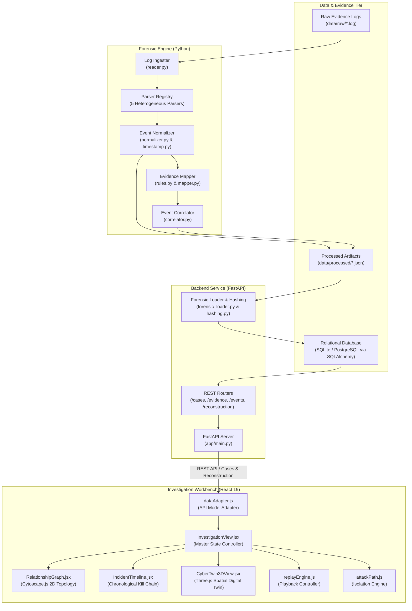

# System Architecture

**Project:** Cyber-Twin — Digital Forensics & Incident Reconstruction Platform  
**Architecture Pattern:** Layered Forensic Processing Pipeline & Reactive Investigation Workbench  

---

## 1. Architecture Overview

Cyber-Twin decouples digital forensic ingestion and correlation from the investigator's visual experience through a clean, layered architecture:

```text
Evidence Sources
       ↓
Forensic Engine (Ingestion, Parsing, Normalization, MITRE Mapping, Correlation)
       ↓
Normalized / Correlated Events
       ↓
FastAPI Backend (REST API, Case Management, Relational Persistence)
       ↓
React Investigation Workbench (State Synchronization, Dynamic Triage)
       ↓
2D Graph + Chronological Timeline + 3D Cyber Twin + Evidence Inspector
```

The system ingests raw multi-source security logs, standardizes timestamps into UTC ISO-8601 strings, maps threat behaviors to MITRE ATT&CK techniques, groups events into an entity-relationship topology, and exposes the reconstructed incident via a FastAPI REST service. The React frontend consumes this API to drive synchronized 2D, 3D, timeline, and replay visualizations.

---

## 2. System Architecture Diagram



---

## 3. Major Components & Responsibilities

### A. Forensic Processing Engine (`forensic-engine/`)
* **Ingestion (`reader.py`):** Ingests raw log files line-by-line with UTF-8 encoding, isolates line numbers, and classifies sources (`auth`, `endpoint`, `server`, `file_access`, `firewall`).
* **Parsing (`parsing/`):** Employs format-specific regular expressions to extract structured fields (timestamps, usernames, device hostnames, IP addresses, process command lines, file paths, and ports).
* **Normalization (`normalization/`):** Standardizes heterogeneous timestamps into UTC ISO-8601 strings and maps fields into the canonical 11-field `Event v1` contract.
* **Evidence Mapping (`evidence-mapping/`):** Evaluates normalized events against heuristic detection rules, annotating each event with MITRE ATT&CK tactics and techniques.
* **Correlation & Reconstruction (`correlation/`):** Discovers shared entities, synthesizes directed canonical relationships, builds the chronological timeline, and outputs the structured `ReconstructedIncident`.

### B. FastAPI REST Backend (`backend/app/`)
* **Application Core (`main.py`):** Configures FastAPI, CORS middleware, lifespan events, and router registration.
* **API Routers (`routes/`):** Serves 16 REST endpoints for cases, evidence artifacts, events, findings, and incident reconstruction payloads.
* **Data Models (`models/`):** SQLAlchemy ORM models (`CaseModel`, `EvidenceModel`, `EventModel`, `FindingModel`).
* **Services (`services/`):** Computes SHA-256 evidence digests (`hashing.py`) and ingests reconstruction artifacts into the database (`forensic_loader.py`).

### C. Relational Data Layer
* **SQLite / PostgreSQL:** Stores cases, digital evidence records, normalized events, and findings.
* **File System:** Stores raw log evidence (`data/raw/`) and serialized JSON reconstruction artifacts (`data/processed/`).

### D. React Investigation Workbench (`frontend/src/visualization/`)
* **`InvestigationView.jsx`:** Master component orchestrating selection state, telemetry metrics, and split-pane layout.
* **`dataAdapter.js`:** Client-side adapter transforming FastAPI API reconstruction payloads into the unified `CyberTwinDataModel`.
* **`attackPath.js`:** Graph filtering engine that isolates adversary kill-chain progression while dimming background enterprise telemetry.
* **`replayEngine.js`:** Deterministic state machine managing chronological incident playback.

### E. Cytoscape 2D Relationship Graph (`RelationshipGraph.jsx`)
* Interactive network topology built with **Cytoscape.js** using the force-directed **COSE layout**.
* Color-codes entity nodes (Users, Devices, IP Addresses, Servers, Files) and renders directed edges with canonical relationship labels.

### F. Three.js 3D Cyber Twin Infrastructure View (`CyberTwin3DView.jsx`)
* Procedural WebGL scene organizing assets into three enterprise security zones:
  * **External Zone:** Internet / Adversary infrastructure (`198.51.100.0/24`).
  * **Corporate LAN Zone:** Internal workstations and end-user devices (`192.168.1.0/24`).
  * **Restricted Datacenter Zone:** Internal corporate file and database servers.
* Animated quadratic bezier threat beams showing lateral network pivots and data exfiltration.

---

## 4. Data Flow from Evidence to Visualization

1. **Evidence Ingestion:** Raw logs placed in `data/raw/` are ingested and parsed.
2. **Standardization:** Timestamps are normalized to UTC, producing the canonical 11-field Event v1 model.
3. **Correlation:** The correlator discovers entity interactions and generates the graph topology and sequential attack stages.
4. **API Serving:** The FastAPI backend persists the reconstruction and serves `/cases/{case_id}/reconstruction`.
5. **Client Adapter:** The React frontend queries the backend API, transforming the payload into graph and timeline elements.
6. **Multi-View Rendering:** The investigation workbench simultaneously illuminates the 2D topology, chronological timeline, 3D digital twin, and evidence inspector.

---

## 5. Visual State Synchronization

The frontend maintains bidirectional focus across all views:
* **Timeline Selection:** Selecting an event in the timeline illuminates participating nodes and edges in the 2D graph, updates the evidence inspector, and animates the 3D camera to the involved server or device.
* **Graph Selection:** Selecting a node or edge in the 2D graph filters the timeline to matching events and displays linked metadata.
* **Attack Path Toggle:** Toggling **Attack Path Only** isolates the adversary's lateral route while dimming benign network activity to 10% opacity.
* **Incident Replay:** Advancing playback automatically steps through the timeline, highlights topological edges as they occur in time, and pulses 3D threat beams across network zones.

